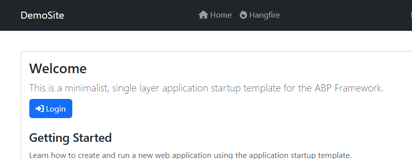
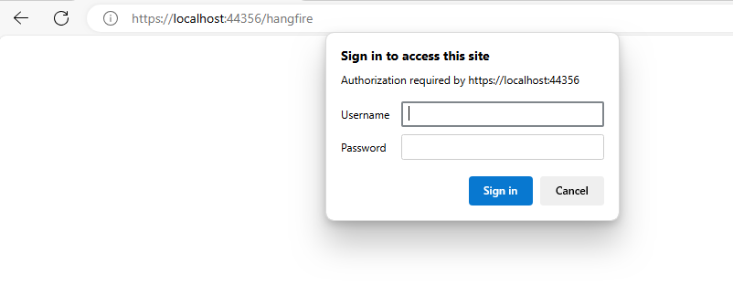
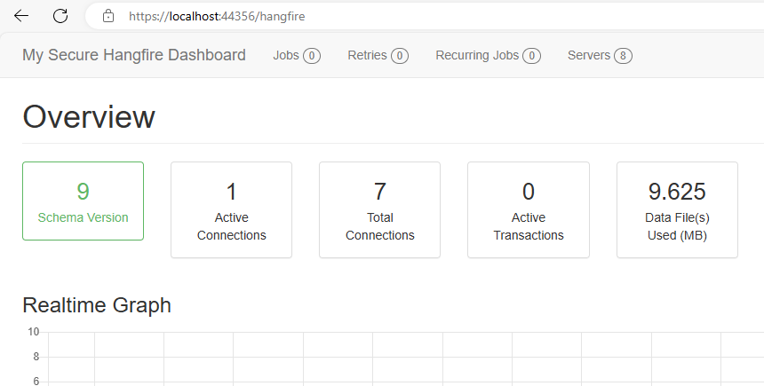

# CommunityAbp.Hangfire.PasswordAuthorization
ABP module which adds a login page and password authentication to the hangfire dashboard.

## Installation

### Package
To install this abp.io module, simply add the nuget package to your project:
```ps
Install-Package CommunityAbp.Hangfire.PasswordAuthorization
```

### Module
Then, add the module to your project's module dependencies:
```csharp
[DependsOn(typeof(CommunityAbpHangfirePasswordAuthorizationModule))]
public class MyProjectModule : AbpModule
{
}
```

### Setup
Finally, configure the password in your project's `appsettings.json`:
```csharp
private void ConfigureHangfire(IServiceCollection services, IConfiguration configuration)
{
    services.AddAbpHangfireDashboardWithLogin(
        authOptions =>
        {
            authOptions.Username = "admin";
            authOptions.Password = "password123";
        },
        dashboardOptions =>
        {
            dashboardOptions.DashboardTitle = "My Secure Hangfire Dashboard";
            // Other dashboard configurations...
        }
    );

    services.AddHangfire(config =>
    {
        config.UseSqlServerStorage(configuration.GetConnectionString("Default"));
    });

    services.AddHangfireServer();
}
```

## Example



When trying to access the dashboard unauthenticated, the following prompt is shown:



Here, the account used in the sample is `admin`/`password123`. Entering that, let's me access the dashboard:

